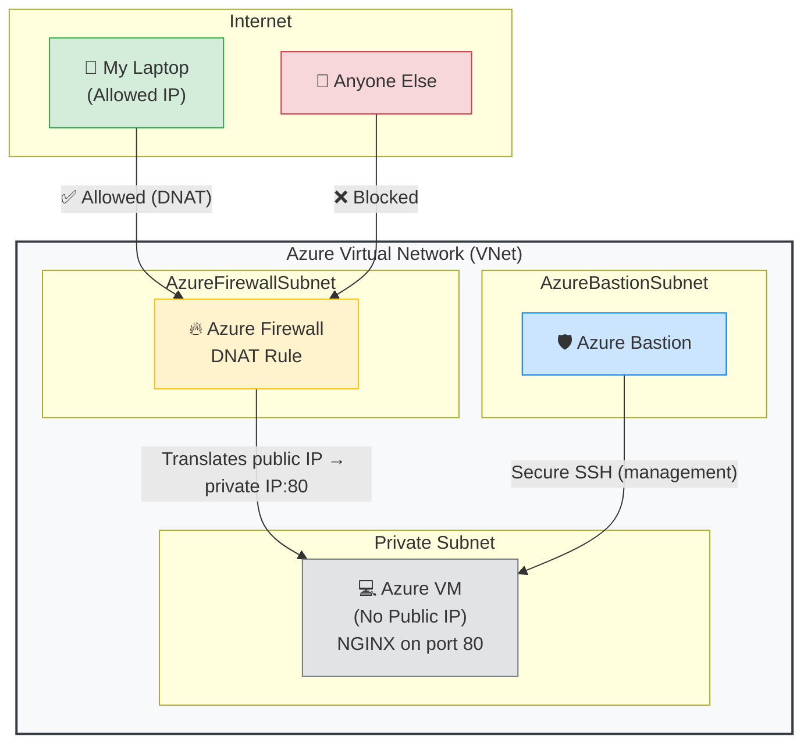

# 🔒 Azure Network Security — Private VM Access with Firewall & Bastion

A hands-on Azure networking project that demonstrates how to secure a virtual machine using **Azure Firewall DNAT rules** and **Azure Bastion**, with **zero public IP** on the VM.

> **Goal:** Only my laptop can reach the web application running on the VM. Anyone else trying to connect is blocked by the Firewall.

---

## 🙋 What I Built & Why

This project applies real-world Azure network security patterns:

- Isolate a VM in a private subnet with **no public IP**
- Control all inbound internet traffic through **Azure Firewall**
- Use **Azure Bastion** for secure management access (SSH) without exposing the VM

The result is a defense-in-depth setup where the VM is unreachable from the public internet except through explicitly allowed paths.

---

## 🏠 Architecture



> **Traffic flow**
> - Only the allowed laptop IP can reach the web app through the Firewall DNAT rule.
> - All other internet traffic is blocked.
> - Management access (SSH) goes through Azure Bastion — the VM itself has **no public IP**.

---

## 🛡️ Security Design

| Component            | Purpose                                      | Configuration                                      |
|----------------------|----------------------------------------------|----------------------------------------------------|
| **Azure Firewall**   | Controls all inbound internet traffic        | DNAT rule — only my laptop’s public IP allowed     |
| **Azure Bastion**    | Secure SSH access for management             | No public IP needed on the VM                      |
| **Private Subnet**   | Isolates the VM from the internet            | No public IP on the VM NIC                         |
| **NSG**              | Additional layer of traffic filtering        | Attached to the VM subnet                          |
| **No Public IP on VM** | VM is completely unreachable directly      | All access goes through Firewall or Bastion        |

---

## 📁 What’s Running on the VM

| Item            | Details                          |
|-----------------|----------------------------------|
| **OS**          | Ubuntu 24.04 LTS                 |
| **Web Server**  | NGINX                            |
| **Application** | Custom HTML page on port 80      |
| **Access**      | Only via Firewall DNAT → private IP translation |

---

## 🚀 How I Built It

### Step 1 — Create the VNet with 3 Subnets

```
Portal → Virtual Networks → Create
```

| Subnet               | Address Range | Purpose                          |
|----------------------|---------------|----------------------------------|
| `AzureFirewallSubnet`| 10.0.0.0/26   | Required name for Azure Firewall |
| `AzureBastionSubnet` | 10.0.1.0/27   | Required name for Azure Bastion  |
| `private-subnet`     | 10.0.2.0/24   | Where the VM lives               |

### Step 2 — Deploy Azure Firewall

```
Portal → Create → Azure Firewall
→ Attach to AzureFirewallSubnet
→ Create new Public IP for Firewall
→ Firewall Policy: create new
```

### Step 3 — Deploy Azure Bastion

```
Portal → Create → Azure Bastion
→ Attach to AzureBastionSubnet
→ Create new Public IP for Bastion
```

### Step 4 — Create VM with No Public IP

```
Portal → Create Virtual Machine
→ Subnet: private-subnet
→ Public IP: None          ← key setting
→ Authentication: SSH public key
```

### Step 5 — Connect via Bastion & Install NGINX

```
Portal → VM → Connect → Bastion
→ Enter username and SSH key
```

Once inside the VM:

```bash
sudo apt update
sudo apt install nginx -y

# Create a custom HTML page
sudo nano /var/www/html/index.html

# Start and enable NGINX
sudo systemctl enable nginx
sudo systemctl start nginx

# Verify
curl localhost
```

### Step 6 — Configure Firewall DNAT Rule

```
Portal → Firewall Policy → DNAT rules → + Add a rule collection
```

**Rule Collection**

| Field    | Value             |
|----------|-------------------|
| Name     | `allow-my-laptop` |
| Priority | 100               |
| Action   | DNAT              |

**Rule**

| Name           | Source                 | Protocol | Dest Port | Translated Address | Translated Port |
|----------------|------------------------|----------|-----------|--------------------|-----------------|
| `laptop-to-vm` | `MY_LAPTOP_PUBLIC_IP`  | TCP      | 80        | `VM_PRIVATE_IP`    | 80              |

> ⚠️ Replace `MY_LAPTOP_PUBLIC_IP` with your real public IP ([whatismyip.com](https://whatismyip.com)).

---

## ✅ How to Test It

| Test | Action | Expected Result |
|------|--------|-----------------|
| **1. From your laptop or which you allow** | Open browser → `http://FIREWALL_PUBLIC_IP` | NGINX HTML page loads ✅ |
| **2. From another IP** | Use VPN / different network → same URL | Connection times out / refused ❌ |
| **3. No public IP on VM** | Portal → VM → Overview | Public IP address: **None** |
| **4. Bastion still works** | Portal → VM → Connect → Bastion | Successful SSH connection ✅ |

---

## 🔑 Key Concepts Demonstrated

| Concept                  | Meaning                                                                 | Where Used                  |
|--------------------------|-------------------------------------------------------------------------|-----------------------------|
| **Defense in depth**     | Multiple security layers instead of a single control                    | Firewall + NSG + no public IP |
| **DNAT**                 | Destination Network Address Translation (Firewall public IP → VM private IP) | Firewall rule             |
| **Zero-trust networking**| VM is unreachable by default; access is explicitly granted              | No public IP on VM          |
| **Bastion**              | Secure jump host — manage VMs without exposing SSH to the internet      | VM management               |
| **Subnet isolation**     | Each component lives in its own dedicated subnet                        | VNet design                 |
| **IP allowlisting**      | Only specific source IPs are permitted through the Firewall             | DNAT source filter          |

---

## 🐛 Real Issues I Solved

### Issue 1 — `apt update` returning 470 error

**Cause:** Azure Firewall Application rules perform HTTP inspection, which breaks `apt` signature verification.  
**Fix:** Replaced the Application rule with a Network rule that allows raw TCP (no HTTP inspection).

### Issue 2 — Firewall rule configured but not working

**Cause:** No Route Table was attached to the private subnet, so VM traffic bypassed the Firewall.  
**Fix:** Created a Route Table with `0.0.0.0/0 → Virtual Appliance (Firewall private IP)` and associated it with the private subnet.

---

## 💰 Cost Awareness

> ⚠️ Azure Firewall is expensive (~€1/hour). **Delete resources after the demo** to avoid unnecessary charges.

```bash
# Delete the entire resource group when finished
Portal → Resource Groups → vnet-demo → Delete resource group
```

---

## 🤞 What This Leads To

This project is a foundation for more advanced designs:

- [ ] Hub-spoke network topology
- [ ] Application Gateway (WAF) in front of web apps
- [ ] Azure Private Endpoints for PaaS services
- [ ] Network monitoring with Azure Network Watcher

---

## 📂 Repository

This project is part of my Azure DevOps & Cloud Engineering portfolio:

**[github.com/AsadulCloud/azure-devops-portfolio](https://github.com/AsadulCloud/azure-devops-portfolio)**

---

> 💡 Built as part of a self-directed Azure DevOps & Cloud Engineering curriculum.  
> Actively looking for Junior Cloud / DevOps Engineer roles in Lisbon, Portugal.
