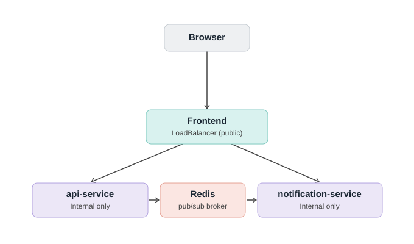

# Task Manager — Microservices Demo

A 3-microservice application demonstrating **asynchronous, event-driven
communication** between services — a different pattern from the direct
request/response style used in the voting app project. Deployed to AKS
with three independent CI/CD pipelines (one per service), and proven
locally end-to-end before ever touching Kubernetes.

## Architecture



*(Browser → Frontend (public) → api-service / notification-service
(internal) → Redis pub/sub, connecting the two backend services
asynchronously.)*

```
Browser
   │
   ▼
[frontend]  (nginx, LoadBalancer - only service with a public IP)
   │  reverse-proxies /api-service/ and /notification-service/
   ▼
[api-service] (Express, ClusterIP - internal only)
   │  publishes events on task creation/completion
   ▼
[Redis]  (pub/sub channel: "task-events")
   │
   ▼
[notification-service] (Express, ClusterIP - internal only)
   subscribes to task-events, logs a "notification" per event
```

**Why this pattern is worth knowing:** the `api-service` never calls
`notification-service` directly. It just publishes an event and moves on.
This means:
- If `notification-service` is down or slow, task creation still works instantly
- You could add a third, fourth, fifth subscriber (e.g. an email service,
  an audit-log service) without ever touching `api-service`'s code
- This is the same underlying idea behind real message queues (RabbitMQ, Kafka,
  Azure Service Bus) — Redis pub/sub here is a lightweight stand-in for learning
  the pattern before using a heavier, more durable message broker

**Why only the frontend gets a public IP:** `api-service` and
`notification-service` are `ClusterIP` (internal-only) — this also sidesteps
the public IP quota problem from the previous project, since only one
`LoadBalancer` service exists here instead of three.

## Local testing (before deploying to AKS)

You'll need Redis running locally, or just deploy straight to AKS (below) —
that's simpler than setting up local Redis for a two-service test.

## Build and push each image

```bash
az acr login --name <your-acr-name>

docker build -t <your-acr-name>.azurecr.io/task-manager-api:latest ./api-service
docker push <your-acr-name>.azurecr.io/task-manager-api:latest

docker build -t <your-acr-name>.azurecr.io/task-manager-notification:latest ./notification-service
docker push <your-acr-name>.azurecr.io/task-manager-notification:latest

docker build -t <your-acr-name>.azurecr.io/task-manager-frontend:latest ./frontend
docker push <your-acr-name>.azurecr.io/task-manager-frontend:latest
```

## Update image references

In each `k8s/*.yaml` file, replace `ACR_LOGIN_SERVER` with your actual ACR
login server (e.g. `asadulcicdacr.azurecr.io`).

## Deploy to your existing AKS cluster

Reuses the same cluster from `10-Terraform-AKS-CICD` — no new Terraform
needed unless you want a dedicated cluster.

```bash
kubectl create namespace task-manager
kubectl apply -f k8s/redis.yaml -n task-manager
kubectl apply -f k8s/api-service.yaml -n task-manager
kubectl apply -f k8s/notification-service.yaml -n task-manager
kubectl apply -f k8s/frontend.yaml -n task-manager
```

## Verify

```bash
kubectl get pods -n task-manager
kubectl get service frontend-service -n task-manager
```

Once `frontend-service` has an `EXTERNAL-IP`, open `http://<that-ip>` in a
browser. Add a task, mark it complete, and watch the Notifications panel
update within a few seconds — that's the pub/sub message actually
travelling from `api-service` → Redis → `notification-service` → back to
the browser via polling.

## CI/CD

Three independent Azure DevOps pipelines, one per microservice, each
triggered only by changes to its own folder — matching the same
per-service pattern used in the voting app project:

```
pipelines/api-service-pipeline.yml           → triggers on api-service/*
pipelines/notification-service-pipeline.yml  → triggers on notification-service/*
pipelines/frontend-pipeline.yml              → triggers on frontend/*
```

Each pipeline: builds and pushes its image to ACR, then deploys via
`KubernetesManifest@0` to the `task-manager` namespace using an
environment-linked Kubernetes service connection. Redis has no pipeline —
it's applied once manually, since it's an off-the-shelf image with no
source code to build.

## Real problems solved

**nginx couldn't resolve sibling containers by name.** Testing the full
stack locally in Docker, `frontend`'s nginx failed at startup with
`host not found in upstream "api-service"`. Root cause: containers on
Docker's default bridge network can only reach each other by IP, not by
name — there's no automatic name resolution. Fixed by creating a custom
Docker network (`docker network create`) and running all containers on
it, which gives each container name-based DNS automatically — the same
mechanism Kubernetes Services provide cluster-wide, for free. Catching
this locally, in minutes, avoided a much harder debugging session inside
Kubernetes later.

**Public IP quota exhausted again.** `frontend-service`'s LoadBalancer
stayed `<pending>` indefinitely. Traced with `az network public-ip list`
to the same 3-IPs-per-subscription/region ceiling hit on the previous
project — an old, still-running service from that earlier project (in a
different namespace, on the same shared cluster) was quietly holding one
of the three available IPs. Fixed by deleting the unused old service to
free the IP. Longer-term fix (not yet implemented): an Ingress Controller,
so multiple apps on this cluster share one public IP instead of each
grabbing its own.

**`KubernetesManifest@0` needed explicit service connection.** The pipeline
task failed with `Input required: kubernetesServiceConnection` on both
the secret-creation and deploy steps — the `environment:` field alone
does not automatically supply this to either task, contrary to
expectation. Fixed by adding `kubernetesServiceConnection:` explicitly to
both `KubernetesManifest@0` steps in all three pipelines.

## Runbook

If notifications stop appearing after adding a task:
1. `kubectl logs deployment/notification-service -n task-manager` — check
   for connection errors to Redis
2. Confirm Redis itself is healthy: `kubectl get pods -n task-manager`,
   then `kubectl exec -it <redis-pod> -n task-manager -- redis-cli ping`
   (should return `PONG`)
3. If api-service's task creation still works but no notification appears,
   check `kubectl logs deployment/api-service -n task-manager` for a
   failed Redis publish

## Next steps (optional extensions)

- Add a database (Postgres) so tasks persist across pod restarts, instead
  of the current in-memory array
- Swap Redis pub/sub for Azure Service Bus or RabbitMQ, to see the same
  pattern with a production-grade message broker
- Add an Ingress Controller to share one public IP across multiple
  projects on this cluster, instead of each grabbing its own LoadBalancer
