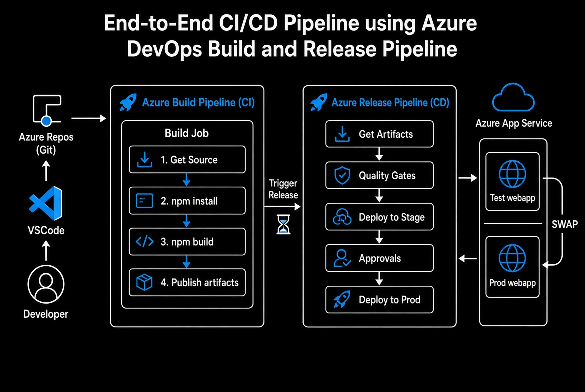
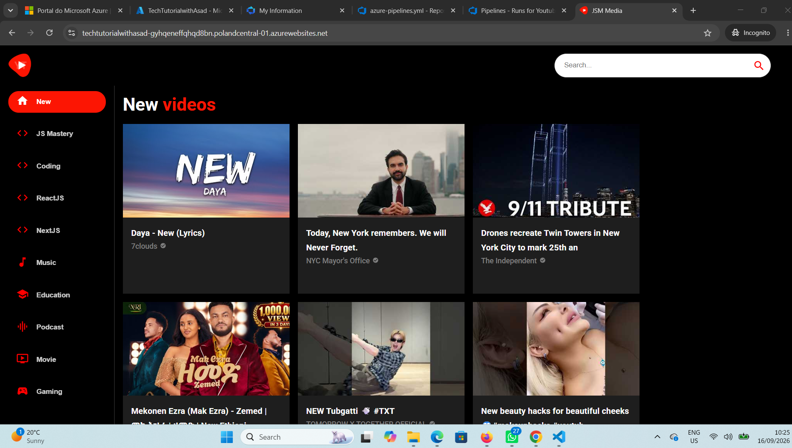
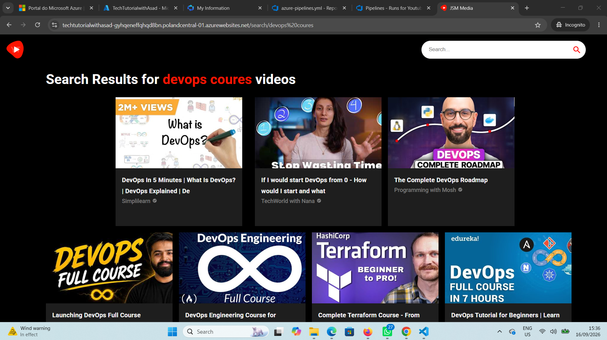
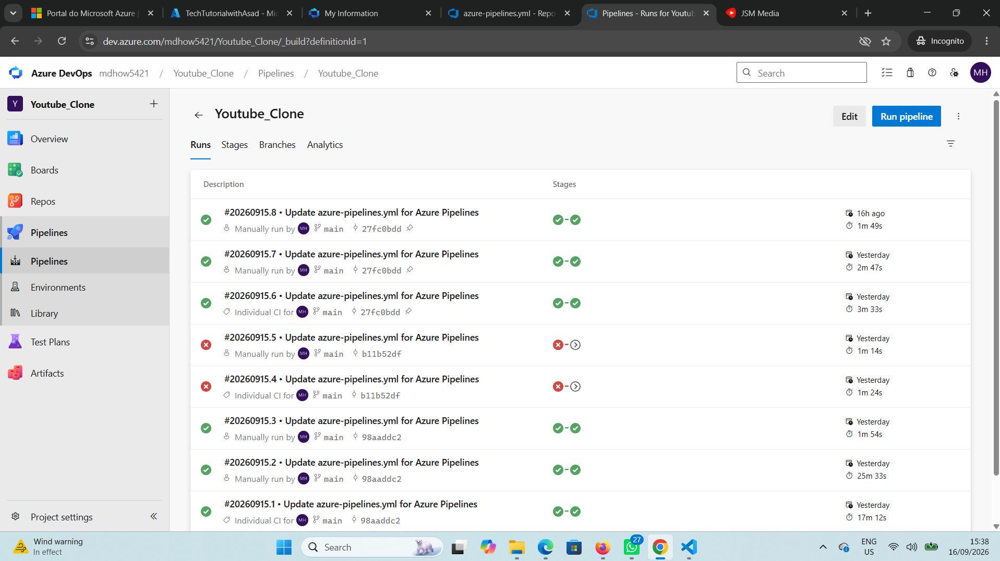
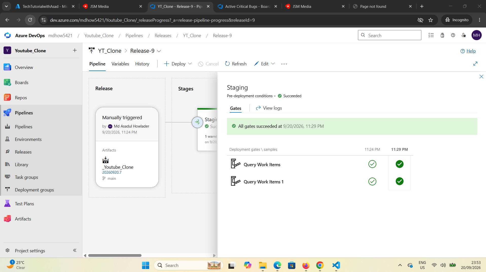
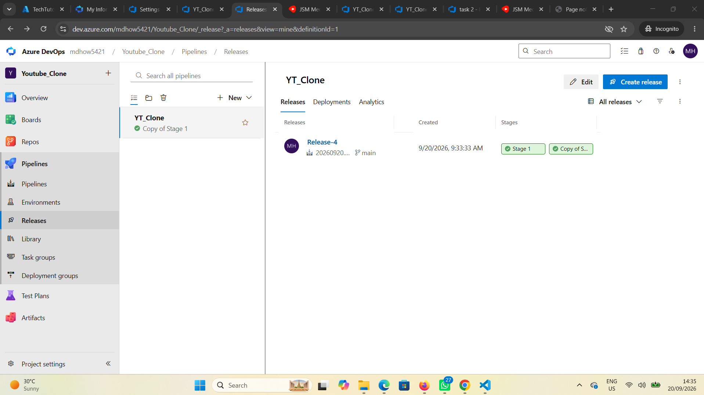

# 🎬 YouTube Clone — End-to-End CI/CD with Azure DevOps

[](https://azure.microsoft.com/en-us/products/devops/pipelines)
[](https://reactjs.org/)
[](https://mui.com/)
[](https://azure.microsoft.com/en-us/products/app-service)
[](LICENSE)

> A production-ready **React 18 + Material UI 5** YouTube Clone fully automated with **Azure DevOps CI/CD** (YAML Build + Classic Release) and deployed to **Azure App Service**.

**🔗 Live Demo:** [techtutorialwithasad-gyhqeneffqhqd8bn.polandcentral-01.azurewebsites.net](https://techtutorialwithasad-gyhqeneffqhqd8bn.polandcentral-01.azurewebsites.net)

> ℹ️ **Note:** After completing and thoroughly testing this project, the Azure resources were intentionally decommissioned to avoid ongoing costs on a free-tier subscription. The full CI/CD pipeline, code, screenshots, and documentation below demonstrate a working, successfully deployed application. The project can be redeployed on request.

---

## 🎯 Project Goal

This is **not** just another frontend project.  
It is a practical **DevOps case study** designed to demonstrate real-world skills that hiring managers look for in a Junior Azure DevOps / Cloud Engineer:

- Multi-stage CI/CD using both **YAML** and **Classic Release** pipelines
- Secure secret management
- Artifact handling between stages
- Automated quality gates based on Azure Boards
- Static site deployment to Azure App Service
- Production debugging (API keys, runtime stack, rate limits)
- Build-time environment variable injection in React

Every challenge listed below was encountered and solved while building and deploying this application.

---

## 🏗️ Architecture Overview




---

## 🛠️ Tech Stack

| Category              | Technology                                      | Purpose                                      |
|-----------------------|-------------------------------------------------|----------------------------------------------|
| Frontend              | React 18 + Material UI 5                        | Modern, responsive UI                        |
| API                   | RapidAPI – YouTube v31 (`ytdlfree`)             | Video search, channel & related data         |
| CI                    | Azure Pipelines (YAML)                          | Build, secret injection, artifact publishing |
| CD                    | Azure Pipelines (Classic Release)               | Quality gates, approvals, slot swap          |
| Hosting               | Azure App Service (Linux – Static Site)         | Runtime stack: `STATICSITE\|1.0`             |
| Secrets Management    | Azure Pipeline secret variables                 | `REACT_APP_RAPID_API_KEY` injected at build  |
| Version Control       | Azure Repos (Git)                               | Source of truth                              |

---

## 📂 Project Structure

```
Youtube_Clone/
├── public/
├── src/
│   ├── components/          # Navbar, VideoCard, ChannelCard, etc.
│   ├── utils/
│   │   ├── fetchFromAPI.js  # Centralized RapidAPI client
│   │   └── constants.js
│   ├── App.js
│   └── index.js
├── azure-pipelines.yml      # Build pipeline (YAML)
├── package.json
├── .env.example
└── README.md
```

---

## ⚙️ Pipeline Highlights

This project uses a **hybrid approach** that many real companies still use:

### 1. Build Pipeline (CI – YAML)
Defined in `azure-pipelines.yml`. Triggers on every push to `main`.

- Get sources
- `npm install`
- Securely inject `REACT_APP_RAPID_API_KEY` from a pipeline **secret variable**
- `npm run build`
- Publish the `build/` folder as artifact named `drop`

### 2. Release Pipeline (CD – Classic)
Triggered automatically after a successful build.

1. Download artifacts
2. **Automated Quality Gate** (see next section)
3. Deploy to **Test** slot on Azure App Service
4. Manual Approval
5. Deploy to **Production** slot
6. Slot Swap between Test and Prod

> **Security Best Practice:** The RapidAPI key is **never** committed to the repository. It exists only as a secret variable and is injected at build time.

---

## 🛡️ Automated Release Gates (Quality Gate)

One of the most important parts of this project was implementing **release governance**.

I configured an automated pre-deployment gate using the **Query Work Items** task:

- Saved Azure Boards query:
  - Work Item Type = `Bug`
  - Severity = `1 - Critical`
  - State ≠ `Done`
- Upper threshold set to **0** matching items

**Result:**  
If any critical bug is still open, the gate **fails and blocks the release automatically**.

**End-to-end verification I performed:**
1. Created a test Critical bug (State = Approved)
2. Triggered a release → gate failed and blocked deployment
3. Marked the bug as Done
4. Re-ran the release → gate passed and continued to Production

This demonstrates practical release governance without relying only on manual approvals.

---

## 🐛 Real Challenges Solved

| Challenge | Solution | Skill Demonstrated |
|-----------|----------|--------------------|
| Classic Release Pipelines not available by default | Designed a clean multi-stage YAML pipeline first, then configured Classic Release for CD | Modern Azure DevOps practices |
| Build artifacts not available in Deploy stage | Used `PublishBuildArtifacts` + `DownloadBuildArtifacts` correctly | Understanding of agent isolation |
| React environment variables not available at runtime | Injected all `REACT_APP_*` variables during the **Build** stage | Build-time vs runtime knowledge |
| 401 / 429 API errors after successful deployment | Diagnosed via browser DevTools and corrected RapidAPI subscription | Production debugging |
| Gate query matched nothing (`State = Active` did not exist) | Discovered Basic process template uses New / Approved / Committed / Done → adjusted query to `State <> Done` | Process template awareness & query debugging |
| Free-tier App Service does not support deployment slots | Documented the intended slot + swap pattern and the tier limitation | Understanding of service tier constraints |


These are the exact types of problems junior engineers face in real jobs — solving them shows practical experience.

---

## 🚀 Run Locally

```bash
git clone https://github.com/AsadulCloud/azure-devops-portfolio/edit/main/17-Youtube-Clone-Project/
cd Youtube_Clone
npm install
```

Create a `.env` file in the root:

```env
REACT_APP_RAPID_API_KEY=your_rapidapi_key_here
```

Start the development server:

```bash
npm start
```

> Get a free API key: [RapidAPI – YouTube v31](https://rapidapi.com/ytdlfree/api/youtube-v31)

---

## 📸 Screenshots

| Home Page | Search Results | Pipeline Success | Quality Gate |
|-----------|----------------|------------------|--------------|
|  |  |  |  |   |

---

## 📚 Key Skills Demonstrated

- Designing hybrid CI/CD pipelines (YAML Build + Classic Release)
- Implementing automated Quality Gates using Azure Boards queries
- Secure secret management with pipeline variables
- Artifact publishing and consumption across stages
- Deploying static React applications to Azure App Service with correct runtime stack
- Understanding React environment variable behavior (build-time injection)
- Debugging real production issues using logs + browser DevTools
- Working with third-party APIs, rate limits, and subscription constraints
- Clear documentation of platform limitations (deployment slots on free tier)

---

## 🙋 About Me

**Md Asadul Howlader**  
Junior Azure DevOps / Cloud Engineer  
📍 Lisbon, Portugal

I’m passionate about building reliable CI/CD pipelines and deploying applications to the cloud. This project is one of the practical ways I continuously improve my Azure DevOps and cloud engineering skills.

**Let’s connect!**  
- LinkedIn: [https://www.linkedin.com/in/md-asadul-howlader-96aa821b9/]
- GitHub: [https://github.com/AsadulCloud/azure-devops-portfolio/]  


---

⭐ If you found this project useful, feel free to star the repository!  
I’m always open to feedback, collaboration, or opportunities in Azure DevOps / Cloud Engineering.
```
