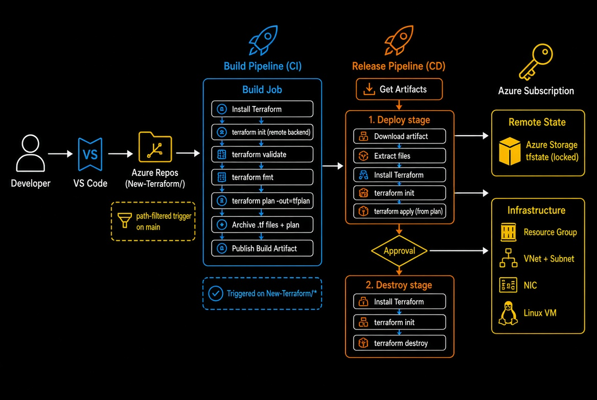

# Terraform CI/CD on Azure DevOps

**Automated Build + Release pipelines** that provision real Azure infrastructure (Resource Group, VNet, Subnet, NIC, and VM) using Terraform — with remote state, path-scoped triggers, and a clean separation between planning and deployment.

---

## Project Goal

This project demonstrates a realistic Infrastructure-as-Code CI/CD workflow, not a one-off `terraform apply`.

It separates the **planning phase** (Build pipeline) from the **deployment phase** (Release pipeline), authenticates exclusively through an Azure DevOps service connection (no hardcoded secrets), and stores state remotely in Azure Blob Storage with locking enabled.

Most of the value is not the Terraform code itself — it is the process of making a two-stage pipeline reliably hand off a Terraform plan from Build to Release, and the real-world issues that were encountered and solved along the way.

---

## Architecture Overview

The solution uses a clean two-stage pipeline:

1. **Build Pipeline (CI)** — Validates the Terraform configuration and generates a plan file.
2. **Release Pipeline (CD)** — Applies the saved plan (Deploy stage) or tears down the infrastructure (Destroy stage).

State is stored remotely in Azure Blob Storage with locking enabled. Authentication is handled entirely through an Azure DevOps service connection — no secrets are stored in code.



---

## Tech Stack

| Category        | Technology                                              | Purpose                              |
|-----------------|---------------------------------------------------------|--------------------------------------|
| IaC             | Terraform 1.6 + azurerm provider 5.x                    | Declarative Azure infrastructure     |
| CI              | Azure Pipelines (YAML, path-triggered)                  | Init, validate, fmt, plan, package   |
| CD              | Azure Classic Release Pipeline                          | Apply the previously generated plan  |
| State Backend   | Azure Blob Storage (`tfstate5421` / `tfstate` container)| Remote, locked Terraform state       |
| Authentication  | Azure DevOps Service Connection (Workload Identity)     | No hardcoded secrets                 |
| Target Resources| Resource Group, VNet, Subnet, NIC, Linux VM             | Provisioned infrastructure           |

---

## Project Structure

```
New-Terraform/
├── main.tf              # Resource Group, VNet, Subnet, NIC, VM
├── provider.tf          # azurerm provider (no hardcoded credentials)
├── variables.tf         # prefix, location, etc.
├── backend.tf           # Azure Storage remote backend
├── .gitignore           # excludes .tfvars, secrets, .terraform/
└── azure-pipelines.yml  # Build pipeline definition (path-triggered)
```

The Release pipeline is defined in the Azure DevOps UI (Classic Release) and consumes the artifact published by the Build pipeline.

---

## Pipeline Breakdown

### Build Pipeline (CI)

Triggered only on changes under `New-Terraform/**`:

1. **Install Terraform** — `TerraformInstaller@1` (CLI is not pre-installed on hosted agents)
2. **terraform init** — connects to the Azure Storage remote backend via the service connection
3. **terraform validate** — catches syntax and configuration errors early
4. **terraform fmt** — enforces consistent formatting
5. **terraform plan -out=tfplan** — generates a plan file in the same working directory as the `.tf` files
6. **Archive Files** — zips the entire working directory (configuration + plan file) with `includeRootFolder: false`
7. **Publish Build Artifacts** — makes the zip available to the Release pipeline

### Release Pipeline — Deployment Stage (CD)

1. Download the build artifact
2. Extract the files
3. Install Terraform (Release agents are separate machines)
4. `terraform init`
5. `terraform apply tfplan` (or `terraform apply --auto-approve` against the saved plan)

### Release Pipeline — Destroy Stage (manual)

A separate, independently triggerable stage:

1. Install Terraform
2. `terraform init` (reconnects to the same remote state)
3. `terraform destroy --auto-approve`

Keeping Destroy as its own stage allows infrastructure to be torn down on demand without re-running the full deployment path — useful for a portfolio project where resources should not be left running between demonstrations.

---

## Security

Authentication flows entirely through the Azure DevOps service connection.  
The service principal is granted the necessary RBAC roles (including **Storage Blob Data Contributor** on the state storage account).  

No `client_secret`, `.tfvars` file containing secrets, or hardcoded credentials exist anywhere in the repository.

---

## Real Challenges Solved

| Challenge | Solution | Skill Demonstrated |
|-----------|----------|--------------------|
| Terraform CLI not found on agent | Added `TerraformInstaller@1` before any Terraform tasks | Hosted agent limitations |
| Pipeline hanging on `client_secret` | Removed hardcoded auth variables; provider relies on automatic `ARM_*` injection from the service connection | Secretless authentication patterns |
| `AuthorizationPermissionMismatch` on backend init | Assigned **Storage Blob Data Contributor** role to the service principal (subscription Contributor is not sufficient for data-plane access) | Azure RBAC vs data-plane permissions |
| State blob left locked after cancelled run | Forced lease break with `az storage blob lease break` (state lock ID was empty, so `terraform force-unlock` alone was insufficient) | Terraform state locking internals |
| `SkuNotAvailable` for chosen VM size | Queried available SKUs in the target region and selected a supported size | Regional capacity constraints |
| Release artifact missing `.tf` files | Archive step was packaging only the plan output directory — fixed by archiving the full working directory | Artifact packaging across stages |
| Double-nested folder after extraction | Set `includeRootFolder: false` on the Archive step | Path resolution in multi-stage pipelines |
| Orphaned OS disk blocking destroy / re-apply | Set `delete_os_disk_on_termination = true` and cleaned up leftover disks manually | Resource lifecycle and state-vs-reality drift |
| Accidental secret in Git history | Rotated the credential, rewrote history, and resolved via merge | Git hygiene and credential rotation |

These are the kinds of multi-layered failures that appear in real production pipelines — where the error message rarely points directly at the root cause.

---

## Run Locally

```bash
git clone https://dev.azure.com/mdhow5421/IAC%20Pipeline%20project/_git/azure-devops-portfolio
cd azure-devops-portfolio/New-Terraform
```

Authenticate (no `.tfvars` needed):

```bash
az login
```

```bash
terraform init
terraform plan
terraform apply
```

Tear everything down when finished:

```bash
terraform destroy
```

Terraform’s `azurerm` provider will automatically use your `az login` session (or `ARM_*` environment variables).

---

## Key Skills Demonstrated

- Designing a multi-stage (Build → Deploy → Destroy) Terraform CI/CD workflow in Azure DevOps
- Remote state management with Azure Blob Storage and state locking
- Secretless authentication using Azure DevOps service connections
- Clean resource lifecycle management, including on-demand teardown
- Diagnosing artifact packaging and path-resolution issues across separate pipeline agents
- Azure RBAC troubleshooting (control-plane vs data-plane)
- Resolving Terraform state lock contention
- Handling regional SKU availability constraints
- Git security hygiene (credential rotation and history cleanup)
- Local development environment debugging

---

## About Me

**Md Asadul Howlader**  
Junior Azure DevOps / Cloud Engineer  
Lisbon, Portugal

I am passionate about building reliable CI/CD pipelines and deploying infrastructure to the cloud. This project reflects the real (sometimes messy) process of getting a two-stage IaC pipeline working end-to-end — not just the final working YAML.

**Let’s connect**

- LinkedIn: [linkedin.com/in/asadul-howlader][def]
- GitHub: [https://github.com/AsadulCloud/azure-devops-portfolio]
- Email: [mdhow0007@gmail.com]

---

If you found this project useful, feel free to star the repository.  
I am always open to feedback, collaboration, or opportunities in Azure DevOps / Cloud Engineering.


[def]: https://www.linkedin.com/in/md-asadul-howlader-96aa821b9?utm_source=share_via&utm_content=profile&utm_medium=member_ios